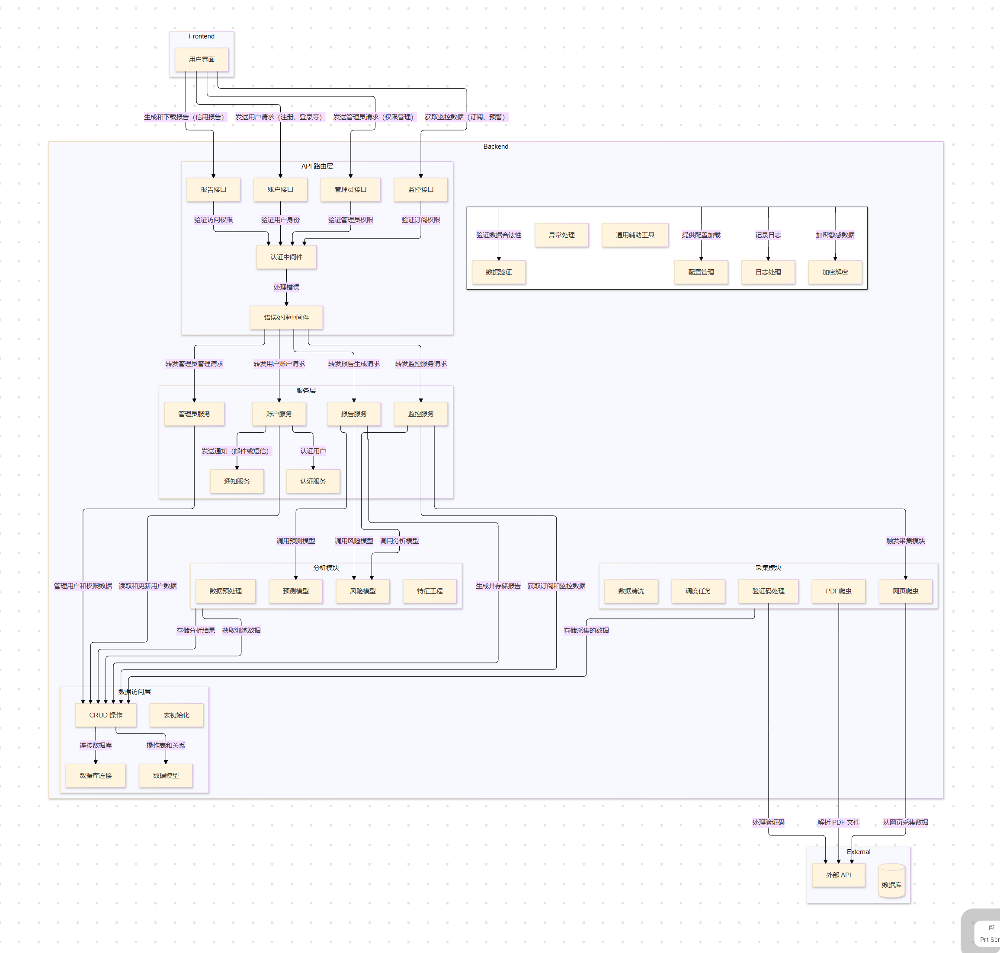

# Credit Insight Backend

Credit Insight 的后端服务是整个系统的核心，负责数据处理、业务逻辑以及与前端的交互。基于现代 Python 架构设计，项目模块化清晰、职责明确，支持高效开发与扩展。

## 项目结构

```
backend/
├── analyzer/           # 风险评估模块
├── api/                # API 路由层
├── collector/          # 数据采集模块
├── database/           # 数据访问层
├── services/           # 服务层，封装业务逻辑
├── utils/              # 工具库
├── main.py             # 后端主入口
└── README.md           # 说明文档
```

## 模块功能介绍

### 1. `analyzer/` - 风险评估模型

- **作用：** 包含用于分析和预测的核心算法模块，支持风险评估、信用分数计算等复杂逻辑。
- **主要功能：**
  - 风险评分计算
  - 信用评分模型
  - 数据分析与预测

---

### 2. `api/` - API 路由层

- **作用：** 提供 RESTful API，用于处理前端的 HTTP 请求，负责将请求转发给服务层并返回响应。
- **主要文件：**
  - `accounts.py`: 用户账户相关接口。
  - `admin.py`: 管理员接口。
  - `monitor.py`: 数据监控接口。
  - `reports.py`: 报表生成接口。
  - `static.py`: 静态文件处理（托管前端构建资源）。

---

### 3. `collector/` - 数据采集模块

- **作用：** 负责从外部来源抓取和解析数据，如网站、PDF 文件等。
- **主要文件：**
  - `main.py`: 数据采集主程序。
  - `decaptcha.py`: 验证码处理。
  - `scrape_data.py`: 数据爬取逻辑。
  - `scrape_pdf.py`: PDF 清单爬取。
  - `pdf_parser.py`: PDF 清单解析。

---

#### **4. `database/` - 数据访问层**
- **作用：**
  封装数据库操作，包括数据模型定义、数据库连接管理、具体的数据操作。
- **子目录与主要文件：**
  - **`link.py`**: 数据库连接管理。
    - 数据库引擎配置和会话管理。
    - 连接字符串和配置加载。
  - **`models/`**: 数据模型定义。
    - `user.py`: 用户模型。
    - `enterprise.py`: 企业模型。
    - `financial_status.py`: 财务状况模型。
    - `credit_report.py`: 信用报告模型。
    - `monitoring_subscription.py`: 监控订阅模型。
    - `decision_report.py`: 决策报告模型。
    - `disclosure_info.py`: 信息披露模型。
    - `overdue_aging_analysis.py`: 逾期账龄分析模型。
  - **`crud/`**: 数据操作封装。
    - `user_crud.py`: 用户数据操作。
    - `enterprise_crud.py`: 企业数据操作。
    - `financialstatus_crud.py`: 财务状况操作。
    - `credit_report_crud.py`: 信用报告操作。
    - `monitoringsubscriptions_crud.py`: 监控订阅操作。
    - `decisionreports_crud.py`: 决策报告操作。
    - `disclosureinfo_crud.py`: 信息披露操作。
    - `overdueaginganalysis_crud.py`: 逾期账龄分析操作。

---

### 5. `services/` - 服务层

- **作用：** 实现核心业务逻辑，作为路由层和数据层之间的桥梁，确保模块职责分离。
- **主要文件：**
  - `accounts.py`: 用户账户管理逻辑。
  - `admin.py`: 管理员控制逻辑。
  - `monitor.py`: 数据监控逻辑。
  - `reports.py`: 数据报告逻辑。
  - `analyzer.py`: 风险评估模型连接器。
  - `collector.py`: 数据采集器连接器。
  - `permissions.py`: 访问权限控制。
  - `maintenance.py`: 系统维护。

---

### 6. `utils/` - 工具库

- **作用：** 提供后端运行所需的通用工具和模块，如日志处理、配置管理、辅助函数等。

---

## 快速开始

### 环境要求

- **Python：** Python 3.12
- **数据库：** openguass

### 安装依赖

1. 克隆项目仓库：

    ```bash
    git clone https://github.com/Yuki-zik/Credit-Insight.git
    cd backend
    ```

2. 同步项目依赖：
   （需要先安装好 Python 3.12 并配置好 [UV](https://docs.astral.sh/uv/) 工具）

    ```bash
    uv sync
    ```

    如需添加依赖，使用 `uv add <package>` 命令。

3. 激活虚拟环境：

    ```bash
    # Windows
    .venv\Scripts\activate

    # Linux
    source .venv/bin/activate
    ```

### 配置项目

- **配置文件：** 位于项目根目录的 `conf` 目录中，包含环境变量和默认配置。根据需要编辑相应的配置文件。

### 运行项目

1. 启动数据库等服务：

    ```bash
    ...
    ```

2. 启动后端服务：

    ```bash
    python main.py
    ```

3. 后端服务默认在 `http://localhost:8000` 运行，可通过浏览器访问。

### 项目目录约定

- **配置文件：** 位于项目根目录的 `conf` 目录中，包含环境变量和默认配置。
- **日志文件：** 默认存储在项目根目录的 `log` 目录中，记录后端运行日志，便于调试和监控。

## 贡献指南

欢迎对 Credit Insight Backend 项目进行贡献！请按照以下步骤操作：

1. Fork 本仓库。
2. 创建您的特性分支 (`git checkout -b feature/新特性`)。
3. 提交您的更改 (`git commit -m '添加新特性'`)。
4. 推送到分支 (`git push origin feature/新特性`)。
5. 提交 Pull Request。

## 许可证

保留所有权利。

## 联系方式

如有任何问题或建议，请联系项目维护者：226004241@nbu.edu.cn

---
