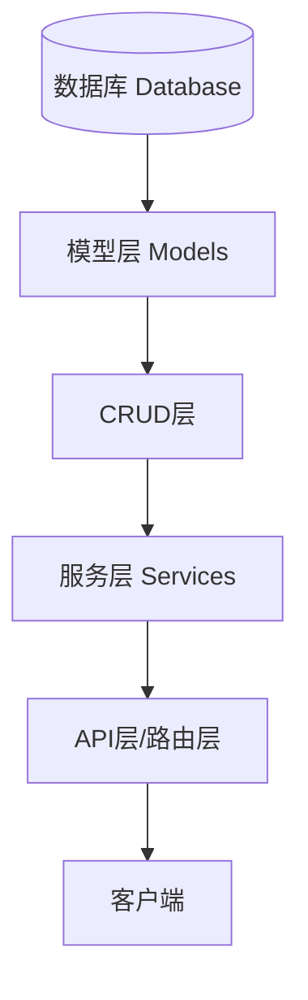
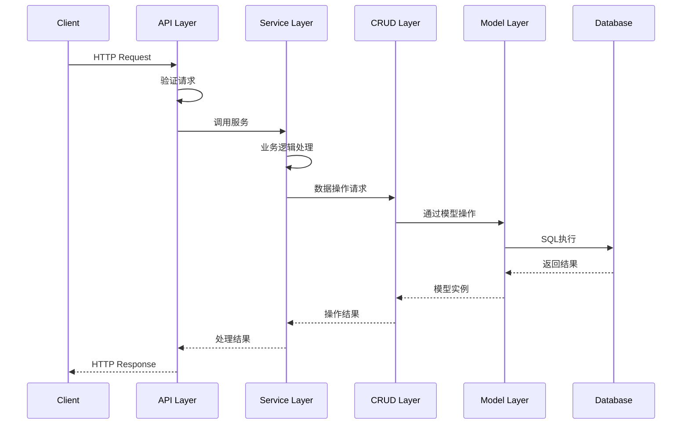

# 后端架构说明

## 1. 整体架构

后端采用分层架构设计，从底层到顶层依次为：



## 2. 各层职责

### 2.1 数据库层 (Database)
- 使用 OpenGauss 数据库
- 负责数据持久化存储
- 提供事务支持和数据完整性保证
- 通过索引优化查询性能

### 2.2 模型层 (Models)
- 定义数据结构和表关系
- 使用 SQLAlchemy ORM 框架
- 实现字段验证和约束
- 定义模型间关联关系

```python
# 示例：企业模型定义
class Enterprise(Base):
    __tablename__ = 'enterprises'
    
    enterprise_id = Column(Integer, primary_key=True)
    company_name = Column(String(255), nullable=False)
    credit_code = Column(String(50), unique=True)
    industry = Column(String(100))
    created_at = Column(TIMESTAMP, server_default=text('CURRENT_TIMESTAMP'))
    
    # 关联关系
    credit_reports = relationship("CreditReport", back_populates="enterprise")
    financial_statuses = relationship("FinancialStatus", back_populates="enterprise")
```

### 2.3 CRUD 层
- 实现基础数据操作
- 封装 SQL 查询
- 不包含业务逻辑
- 提供数据访问接口

```python
# 示例：CRUD 操作
class EnterpriseCRUD:
    @staticmethod
    def create(session: Session, data: Dict[str, Any]) -> Enterprise:
        enterprise = Enterprise(**data)
        session.add(enterprise)
        session.flush()
        return enterprise
    
    @staticmethod
    def get_by_id(session: Session, enterprise_id: int) -> Optional[Enterprise]:
        return session.get(Enterprise, enterprise_id)
```

### 2.4 服务层 (Services)
- 实现业务逻辑
- 管理事务
- 处理数据验证
- 错误处理和日志记录
- 调用 CRUD 层接口

```python
# 示例：服务层实现
class EnterpriseService:
    @staticmethod
    async def create_enterprise(data: Dict[str, Any]) -> Optional[Enterprise]:
        try:
            with get_session() as session:
                # 业务验证
                if await self.check_duplicate_code(data['credit_code']):
                    raise ValueError("Credit code already exists")
                
                # 调用 CRUD 层
                enterprise = enterprise_crud.create(session, data)
                session.commit()
                return enterprise
        except SQLAlchemyError as e:
            logger.error(f"Database error: {str(e)}")
            return None
```

### 2.5 API 层
- 定义路由
- 处理 HTTP 请求
- 参数验证
- 权限控制
- 响应封装

```python
# 示例：API 路由
@router.post("/enterprises/")
async def create_enterprise(
    enterprise_data: EnterpriseCreate,
    current_user: User = Depends(get_current_user)
):
    # 权限检查
    if not current_user.has_permission("create_enterprise"):
        raise HTTPException(status_code=403)
    
    # 调用服务层
    enterprise = await enterprise_service.create_enterprise(
        enterprise_data.dict()
    )
    if not enterprise:
        raise HTTPException(status_code=400)
    
    return enterprise
```

## 3. 数据流向



## 4. 错误处理

每一层都有其特定的错误处理职责：

### 4.1 API 层
- 处理 HTTP 相关错误
- 转换业务错误为 HTTP 响应
- 统一错误响应格式

### 4.2 服务层
- 处理业务逻辑错误
- 记录错误日志
- 事务回滚

### 4.3 CRUD 层
- 处理数据库操作错误
- 抛出具体的数据库异常

## 5. 关键设计原则

### 5.1 单一职责原则
- 每一层只负责其特定的功能
- 避免跨层调用
- 保持代码清晰和可维护

### 5.2 依赖注入
- 使用依赖注入管理组件间的依赖关系
- 便于单元测试和模块替换

### 5.3 异步处理
- 使用异步函数处理 I/O 操作
- 提高系统并发性能

### 5.4 数据验证
- API 层使用 Pydantic 模型验证请求数据
- 服务层进行业务规则验证
- 模型层确保数据完整性

## 6. 性能优化

### 6.1 数据库优化
- 使用连接池管理数据库连接
- 实现查询缓存
- 优化索引设计

### 6.2 查询优化
- 使用 joinedload 优化关联查询
- 实现分页查询
- 避免 N+1 查询问题

### 6.3 缓存策略
- 实现多级缓存
- 缓存常用数据
- 定期更新缓存

## 7. 安全设计

### 7.1 认证授权
- JWT token 认证
- 基于角色的访问控制
- API 权限管理

### 7.2 数据安全
- 敏感数据加密
- SQL 注入防护
- XSS 防护

### 7.3 审计日志
- 操作日志记录
- 错误日志记录
- 安全事件记录

## 8. 部署架构

### 8.1 开发环境
- 本地开发环境配置
- 测试数据库配置
- 开发工具配置

### 8.2 生产环境
- 负载均衡
- 数据库主从复制
- 监控告警

## 9. 代码规范

### 9.1 命名规范
- 类名使用大驼峰命名
- 函数和变量使用小驼峰命名
- 常量使用大写字母

### 9.2 文档规范
- 类和函数必须有文档字符串
- 复杂逻辑需要添加注释
- 保持文档的及时更新

### 9.3 测试规范
- 单元测试覆盖率要求
- 集成测试要求
- 测试用例命名规范 
